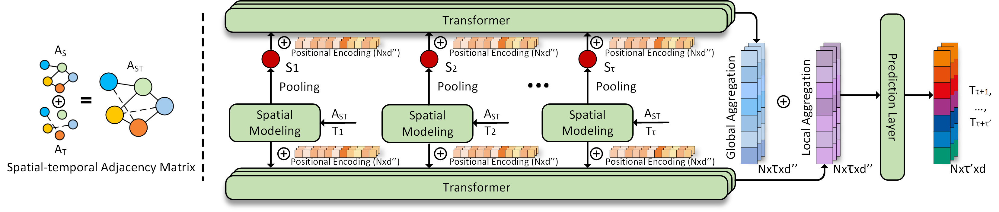

The traffic of nodes constituting the networked systems of today is getting more and more influenced by the interactions among nodes as well as by the temporal fluctuations in the demands of the nodes.
Traditional statistical prediction methods no longer work due to non-linear and dynamic spatio-temporal dependencies in today's network traffic.
The most promising direction of research today is graph neural networks (GNNs) based prediction approaches that are naturally suited to handle graph-structured data.
Unfortunately, the state-of-the-art GNN based approaches model spatial and temporal information separately, which inevitably leads to loss of information about joint dependencies.
These GNN based approaches further do not model spatio-temporal information simultaneously at both local and global scales, leaving significant room for improvement.
We propose NetSight, which, when given a time-series of measurements of any given network metric, collected at various nodes in a network, learns joint spatio-temporal dependencies simultaneously at both global and local scales, and accurately predicts the future values of that metric at those nodes.
We propose several new concepts and techniques in the design of NetSight, such as spatio-temporal adjacency matrix and node normalization.
Through extensive evaluations and comparison with prior approaches using data collected from two large real-world networks, we show that NetSight improves the MAE, RMSE, and SMAPE of prior state-of-the-art graph-based methods by 32.14%, 28.30%, and 20.47% respectively.

