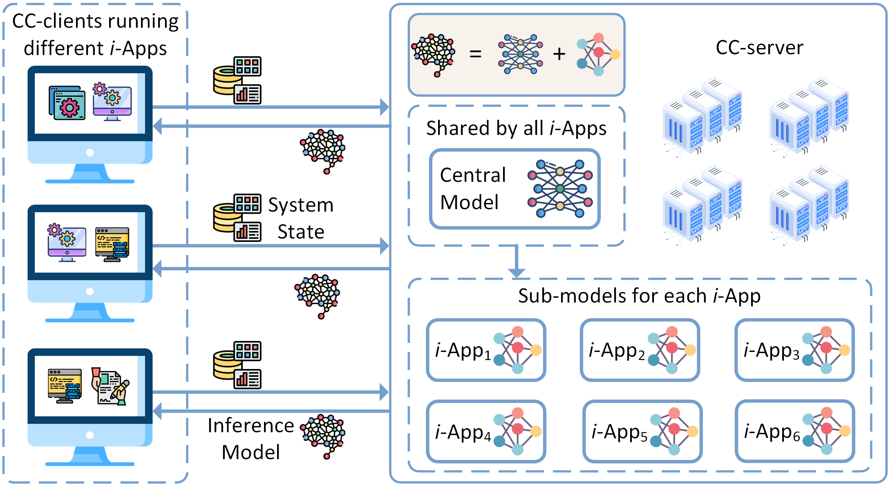

The Congestion Control (CC) module plays a critical role in the Transmission Control Protocol (TCP), ensuring the stability and efficiency of network data transmission. The CC approaches that are commonly used these days employ heuristics-based rules to adjust the sending rate.
It is well known that due to their heuristics-based nature, these approaches are not only unable to adapt to changing network conditions but are also agnostic to the diverse requirements that different applications often have.
Lately, we have seen several learning-based CC approaches that do not rely on fixed heuristics-based rules and thus can adapt to changing network conditions.
Unfortunately, existing learning-based CC approaches have also not been designed to take application requirements into account.
Prior heuristics-based as well as learning-based CC approaches focus on achieving a singular objective, which is often to maximize throughput, even though a lot of applications care more about latency, packet losses, jitter, and/or different combinations of various network metrics.
Motivated by this, we propose a Deep Reinforcement Learning (DRL) based CC framework, namely $$\text{ASC}_{RL}$$, which allows any application to specify any arbitrary objectives that the network traffic of that application should achieve and is able to swiftly adapt to the changes in the objectives of the applications as well as to the changes in the network conditions.
Our $$\text{ASC}_{RL}$$ framework further employs a client-server architecture that serves two purposes: 1) it makes $$\text{ASC}_{RL}$$ highly scalable in terms of the arrival and departure of TCP connections, and 2) it makes $$\text{ASC}_{RL}$$ very lightweight for the nodes maintaining the TCP connections.
We implemented and extensively evaluated $$\text{ASC}_{RL}$$ in a variety of settings.
Our results show that it can not only achieve various objectives but also outperforms prior approaches even in the specific objectives that those approaches were designed to achieve.

