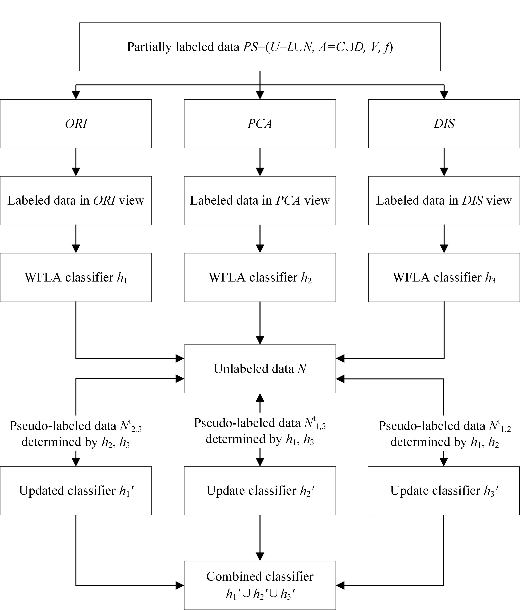

The theory of fuzzy rough sets is an effective soft computing paradigm for dealing with vague, uncertain, or imprecise data. However, most existing fuzzy rough sets-based methods may suffer from robustness since all samples are considered equally and also these methods are designed to cater for supervised or unsupervised learning. In this paper, we propose a weighted fuzzy rough sets-based multi-view tri-training model for partially labeled data. Specifically, considering the negative effect of noise, we first use a technique of data editing to filter potentially possible noises, and then a gradient descent algorithm is employed to optimize the weight of each sample with the objective of maximizing high-order weighted fuzzy dependency, based on which a robust weighted fuzzy rough set model is developed for labeled data. Moreover, we introduce the robust weighted fuzzy rough sets into tri-training and propose multi-view-based robust tri-training for partially labeled data by exploring data representations in the original view, the transformed view of principal component analysis, and the granular view after discretization. Extensive experiments conducted on UCI benchmark and medical diagnosis data sets show that the proposed model achieves favourable results in both supervised and semi-supervised scenarios.

